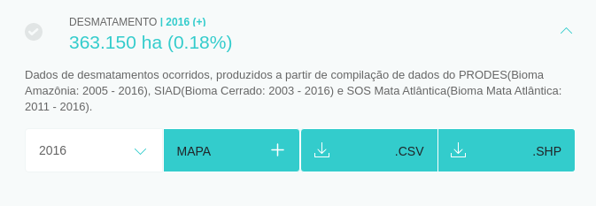

# Funcionalidades

A abordagem da plataforma baseia-se em apresentar um vasto conjunto de dados secundários relevantes (fontes oficiais e dados de referência) em um mapa interativo de fácil navegação. Todos os indicadores estão listados com seus respectivos valores na página inicial da plataforma, promovendo assim o acesso mais rápido a informação.

## Dashboard

O dashboard da Plataforma Risco Socioambiental é formado por quatro elementos principais:

**1 - Indicadores**

A unidade de referência são os municípios, mas também é possível fazer análises considerando todo o território nacional, estados, biomas e regiões específicas de interesse (como o Matopiba e Arco do Desmatamento). Os indicadores também podem ser agrupados por categorias (Agricultura, Ambiental, Econômico, Natural, Pecuária e Social). Conforme os filtros de área são aplicados, os valores são atualizados para região selecionada. Também é possível visualizar o percentual do indicador sob a área total da região. Como é ilustrado na imagem logo abaixo, o Brasil possui 175.361.556 hectares de áreas de pastagens, o que equivale a 20,63% de toda área nacional.

**2 - Mapa interativo**

Área onde todos os indicadores contidos na plataforma podem ser visualizados no mapa para análises e comparações com outros indicadores. Na imagem seguinte temos um exemplo de visualização de indicadores no mapa: indicadores de áreas de pastagens na cor amarela e frigoríficos na cor vermelha.

**3 - Controle de Visualização**

Permite o controle do nível de zoom do mapa, além de ocultar e ativar a visualização da lista de indicadores, controle das legendas dos dados ativos no mapa. O mapa base (refere ao fundo do mapa fornecendo o contexto geográfico para as camadas adicionais) também pode ser alterado conforme a necessidade de análise do usuário. E por último, o ícone de `lupa` ferramenta para pesquisa de propriedade por meio do código do Cadastro Ambiental Rural - CAR.

**4 - Legenda**

As legendas dos dados ativos no mapa contam com um controle de visualização, sobreposição de camadas e também opacidade o que contribui para uma melhor análise do usuário. 

## Ferramenta de pesquisa por propriedade do CAR

O ícone de `lupa` é uma ferramenta desenvolvida para pesquisa de propriedade por meio do código do Cadastro Ambiental Rural - CAR. Ao inserir um código de propriedade o limite é evidenciado no mapa e o usuário pode selecionar os indicadores que deseja analisar.

## Ferramenta de Gerar Relatório

Um dos recursos mais importantes da plataforma é o "Gerar relatório", que traz em formato de gráfico as séries históricas do(s) dado(s) selecionado(s) para uma determinada região definida pelo usuário. Caso o dado não seja temporal, o valor é mostrado apenas para o ano de criação do indicador, como é o caso do dado de Unidades de Conservação de Proteção Integral (2014), Frigoríficos e Matadouros (2017) e Floresta Plantada(2014).

 na região do bioma Cerrado.")
Relatório em formato de gráfico da produção de soja em toneladas, mostrando a sua evolução temporal   (2000 a 2015) na região do bioma Cerrado.

Destaca-se também a possibilidade de visualizar o ranking dos 10 primeiros e 10 últimos Municípios para o indicador escolhido, levando em consideração o ano e região selecionada. O ranking apresenta a posição, nome do município, Unidade Federativa (UF) e valor do indicador.

## Ferramenta de Download de propriedades Sicar

Ferramenta acessível por meio do [link](http://socioambiental.lapig.iesa.ufg.br/sicar).

## Ferramenta de Download

Por fim, os usuários podem fazer o download dos indicadores em formato shapefile (SHP) ou CSV, assim como recuperar o relatório em formato CSV.

