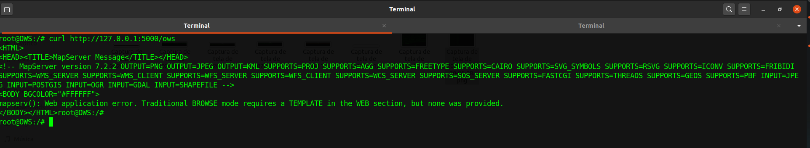

# Introdução

Conforme detalhado na seção [Arquitetura de Software](/02-arq_geral), para execução do RISCOSOCIOAMBIENTAL são necessárias 4 estruturas criadas e funcionais na máquina do usuário:

1. O Banco de Dados `wwf-sicar` restaurado no serviço do MONGODB.

2. O serviço *OWS Server* devidamente configurado e executando em um IP e porta.

3. O *Application Server* e client (Front-end) da aplicação compilados e executando.

4. O Banco de Dados `indicadores.sqlite` na pasta /storage/catalog/Ocultos, criada pelo script.


## Deployment da aplicação RISCOSOCIOAMBIENTAL e OWS Server

A fim facilitar/automatizar todo o processo de execução do Riscosocioambiental e OWS Server foi criado um script que executa todos os passos necessários. Este script deverá executar as seguintes tarefas:

* Download do contâiner do `CONTAINER_OWS.tar.gz` 
* Download do contâiner do `CONTAINER_SOCIOAMBIENTAL.tar.gz`
* Download do contâiner do `CONTAINER_MONGODB.tar.gz`  
* Cria a estrutura de pastas necessárias (ows-cache, catalog, Ocultos e riscosocioambiental) para funcionamento do OWS Server e riscosocioambiental
* Constrói a aplicação do OWS Server e a disponibiliza em um IP e porta.
* Constrói a aplicação do RISCOSOCIOAMBIENTAL e a disponibiliza em um IP e porta.
* Constrói a aplicação do MONGODB-SERVER e a disponibiliza em um IP e porta.

Conforme mencionado anteriormente, a estrutura do OWS Server, RISCOSOCIOAMBIENTAL e MONGODB-SERVER foi construída com o apoio do [Docker](https://www.docker.com/), portanto para instalação do mesmo, deve-se seguir os passos definidos nos tutoriais de acordo com o sistema operacional, seja ele [Debian](https://docs.docker.com/engine/install/debian/) ou [CentOS](https://docs.docker.com/engine/install/centos/). Além do Docker, o script também faz uso das seguintes dependências:

| Dependência | Tutorial para Instalação |
| :------: | ---- |
| Perl | [https://learn.perl.org/installing/unix_linux.html](https://learn.perl.org/installing/unix_linux.html) |
| wget | [https://www.cyberciti.biz/faq/how-to-install-wget-togetrid-of-error-bash-wget-command-not-found/](https://www.cyberciti.biz/faq/how-to-install-wget-togetrid-of-error-bash-wget-command-not-found/) |
| curl | [https://www.cyberciti.biz/faq/how-to-install-curl-command-on-a-ubuntu-linux/](https://www.cyberciti.biz/faq/how-to-install-curl-command-on-a-ubuntu-linux/) |
| Git | [https://gist.github.com/derhuerst/1b15ff4652a867391f03](https://gist.github.com/derhuerst/1b15ff4652a867391f03) |


Após instalação do Docker e das dependências mínimas para o script, deve-se executar o script [`start-socio+ows.sh`](https://drive.google.com/file/d/1NhfkQqGS6HhhpN6LZ8xaRD18xgLFoQ6j/view?usp=sharing) através do comando:

``` sh
$ ./start-socio+ows.sh
```

Inicialmente o script irá pedir ao usuário que informe o local onde o OWS Server e RISCOSOCIOAMBIENTAL deverá criar a estrutura de pastas necessárias para funcionamento. Na imagem abaixo, o usuário terá informado o caminho `/data/containers`. É importante ressaltar que este deverá ser um caminho válido na máquina do usuário.


Em seguida, deve-se informar o diretório onde o cache deverá ser armazenado. Na imagem abaixo, o usuário terá informado novamente o caminho `/storage`. porém, como o OWS Server está armazenado em um contâiner Docker, o script irá mapear automaticamente este caminho para `/STORAGE` dentro da estrutura do Docker.


Após a inicialização do das variáveis necessárias o script irá realizar automaticamente o download do contâiner do OWS Server, RISCOSOCIOAMBIENTAL,MONGODB-SERVER e importá-los corretamente no Docker instalado na máquina do usuário.


Após a importação correta do contâiner, o OWS Server deverá estar executando e aguardando requisições em **localhost** ou **127.0.0.1** na **porta 5000**. A imagem abaixo apresenta um exemplo de requsição feita através do *curl* no endereço `http://127.0.0.1:5000/ows`, que recebe uma pequena página HTML criada pelo MapServer.



Após a importação correta do contâiner, o RISCOSOCIOAMBIENTAL deverá estar executando e aguardando requisições em **localhost** ou **127.0.0.1** na **porta 2000**. A imagem abaixo apresenta um exemplo de requsição feita através do *NAVEGADOR* no endereço `http://127.0.0.1:2000`, que recebe a página do RISCOSOCIOAMBIENTAL.


Após a execução do OWS Server e RISCOSOCIOAMBIENTAL, também é necessário mover o `indicadores.sqlite` presentes no [link](https://drive.google.com/file/d/1Qww9WQ7G1YHZ1ndLEYzrTrcjAklTRP1v/view?usp=sharing) para dentro da pasta `/storage/catalog/Ocultos` criada no caminho informado pelo usuário no início do script.

Por fim, vale ressaltar que uma vez que o contâiner do OWS Server esteja configurado e funcionando não é mais necessário executar o script `start-socio+ows.sh`. Já existe um script na raiz do contâiner que é responsável por executar o OWS Server imediatamente após o contâiner ser inicializado. Portanto, basta executar:

OBS: Dentro da pasta /catalog/Ocultos/ deve existir os dois arquivos `indicadores.sqlite` e `indicadores.map`, caso nao exista os dois nao irá funcionar a aplicação.

`OBS: Após o script finalizar por completo e todos os containers forem criados, deve-se copiar o arquivo indicadores.sqlite para dentro do diretório escolhido pelo usuário durante a execução do script, o arquivo deve ficar em /$DIRETORIO_ESCOLHIDO_PELO_USUARIO/storage/catalog/Ocultos, logo após copiar o mesmo deve ser reiniciado a aplicação para ela poder encontrar este arquivo essencial para seu funcionamento.`

``` sh
$ docker restart APP_SOCIOAMBIENTAL bash
```

E caso deseja entrar no contâiner do OWS-SERVER e verificar os arquivos internos, tais como **logs** de requisições, basta executar:

``` sh
$ docker exec -it OWS bash
$ cd /APP/lapig-maps/src/ows/log
$ tail -f ows-mapserv.log
```

E caso deseja entrar no contâiner do OWS-SOCIOAMBIENTAL e verificar os arquivos internos, tais como **logs** de requisições, basta executar:

``` sh
$ docker exec -it APP_SOCIOAMBIENTAL bash
$ cd /APP/riscosocioambiental/server
$ tail -f app.out
```

E caso deseja entrar no contâiner do MONGODB-SERVER e verificar se o banco foi restaurado com sucesso, tais como **logs** de requisições, basta executar:

``` sh
$ docker exec -it APP_SOCIOAMBIENTAL bash
$ cd /APP/dump
$ cat log-restore.out
```

## Criação do Ambiente de Desenvolvimento

A seguir será abordado como executar a aplicação RISCOSOCIOAMBIENTAL em ambiente de Desenvolvimento. Para o ambiente de desenvolvimento será detalhado um passo a passo partindo do pressuposto que um programador irá dar manutenção ou continuidade no RISCOSOCIOAMBIENTAL. Já o ambiente de produção, será disponibilizado via script que executa todos os passos para disponibilizar o RISCOSOCIOAMBIENTAL em uma porta da máquina que está sendo executado. 


Assim como abordado na [seção](/02-arq_geral/#arquitetura-de-software), o RISCOSOCIOAMBIENTAL foi construído com NodeJS como *Application Server* e Angular como cliente (*WebMap Client*). Portanto, primeiramente é necessária a instalação destes componentes na máquina do desenvolvedor. Para tal, pode-se seguir o passo-a-passo elaborado neste [link](https://www.tecmint.com/install-angular-cli-on-linux/)

Para execução do RISCOSOCIOAMBIENTAL em ambiente de desenvolvimento, primeiramente é necessário realizar um [`fork`](https://github.com/UNIVALI-LITE/Portugol-Studio/wiki/Fazendo-um-Fork-do-reposit%C3%B3rio) do projeto para a sua conta pessoal do Github e em seguida executar um [`git clone`](https://docs.github.com/pt/free-pro-team@latest/github/creating-cloning-and-archiving-repositories/cloning-a-repository) do [repositório do projeto](https://github.com/lapig-ufg/d-pat).

Para inicializar o servidor de aplicação (*Application Server*) deve-se executar o passo-a-passo descrito na [seção](/02-arq_servidor_de_aplicacao/#servidor-de-aplicacao). A execução da mesma irá inicializar o *Application Server* em localhost na porta 3000. Para verificar o seu funcionamento, pode-se realizar a requisição abaixo em um navegador qualquer, que deverá apresentar um resultado semelhante a [este](https://cerradodpat.org/service/deforestation/largest?year=2019&amount=15).

```
http://localhost:3000/service/deforestation/largest?year=2019&amount=15
```

Em seguida, para inicializar o *WebMap Client* localizado na pasta [`src/client`](https://github.com/lapig-ufg/d-pat/tree/master/src/client), basta navegar até a pasta **client** e instalar as dependências listadas no **package.json** através do comando:

```
$ npm install
```

Após a devida instalação das dependências, pode-se então compilar e inicializar a aplicação. Mais uma vez, a fim de facilitar, foi criado um script [`start.sh`](https://github.com/lapig-ufg/d-pat/blob/master/src/client/start.sh) para inicializar o *WebMap Client*, portanto basta executar:

```
$ ./src/client/start.sh
```

Ao finalizar a compilação do projeto, a aplicação estará executando em localhost na porta padrão do Angular, que é a porta 4200. Portanto, para acessar a página Web criada pela aplicação, acesse pelo navegador:

```
http://localhost:4200
```

Após execução dos scripts o OWS Server estará executando na máquina do usuário na porta **5000** e o RISCOSOCIOAMBIENTAL também na máquina do usuário na porta **3000**.
