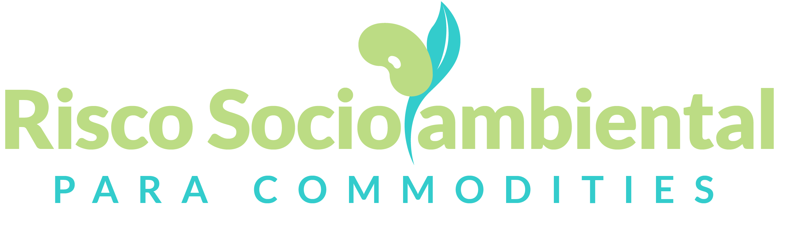

# Documentação Risco Socioambiental

O portal de Risco Socioambiental é uma plataforma robusta e aberta que visa facilitar o cruzamento de informações que permitam identificar potenciais impactos ambientais e sociais ligados à produção agrícola no Brasil, permitindo às instituições financeiras, empresas, governos e outras partes interessadas entender melhor e mitigar riscos associados à produção agropecuária.

Essa é uma documentação para a plataforma [Risco Socioambiental](http://socioambiental.lapig.iesa.ufg.br/home), desenvolvida pelo [Laboratório de Processamento de Images e Geoprocessamento da Universidade Federal de Goiás (LAPIG/UFG)](http://www.lapig.iesa.ufg.br) em parceria com o [WWF](https://www.wwf.org.br/).